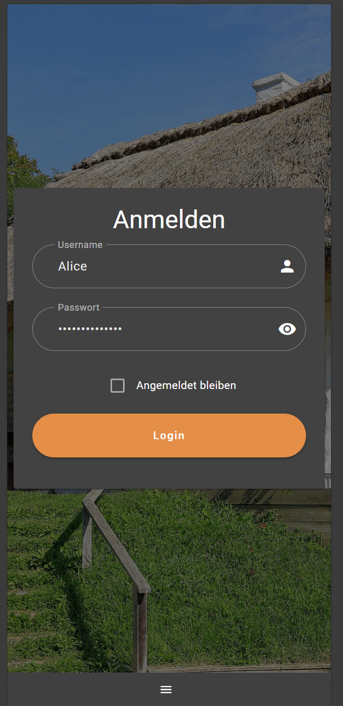
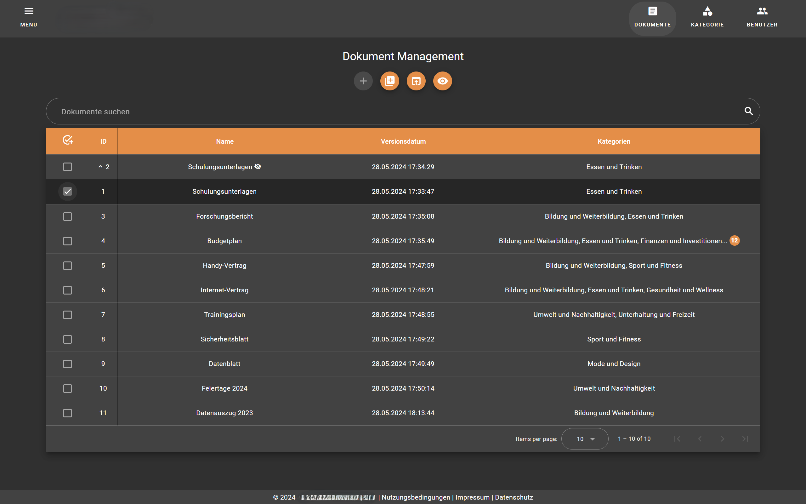
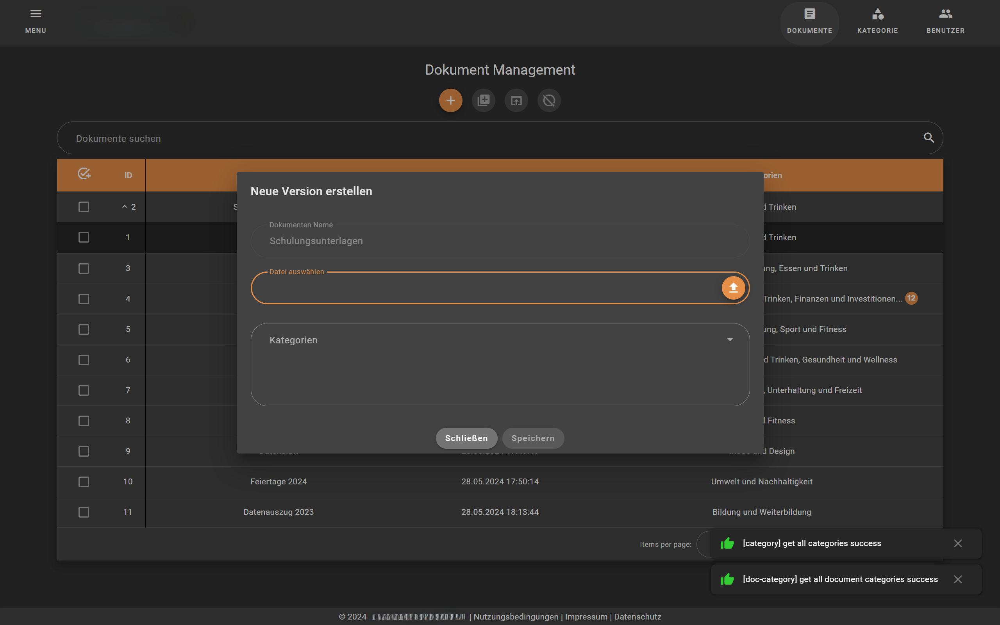
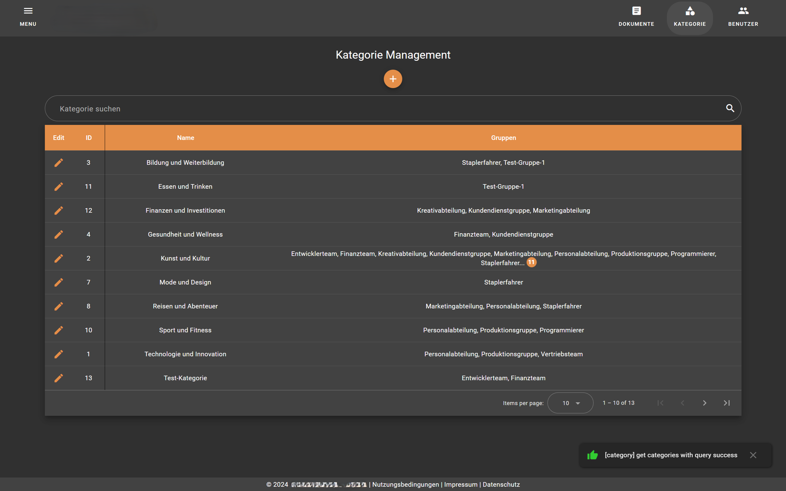
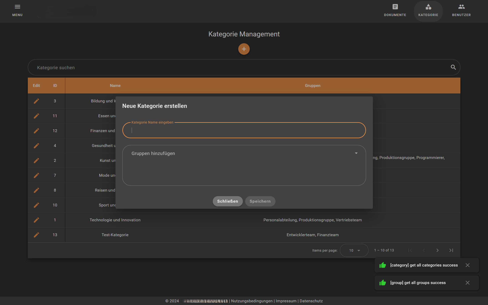
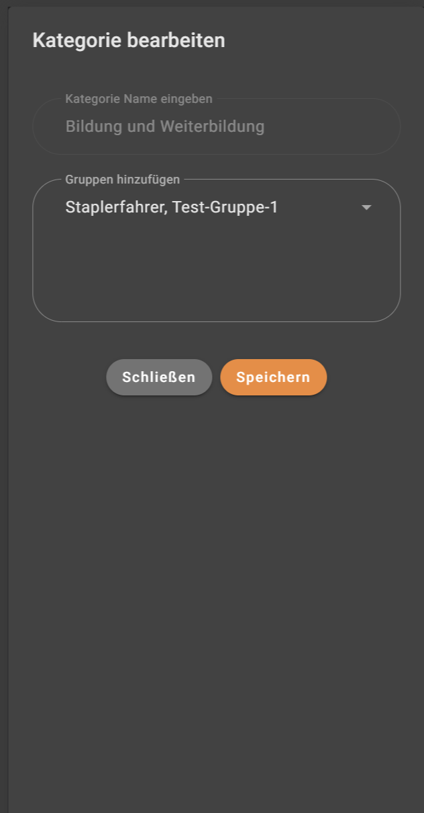
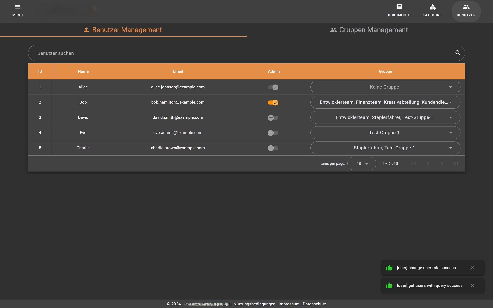
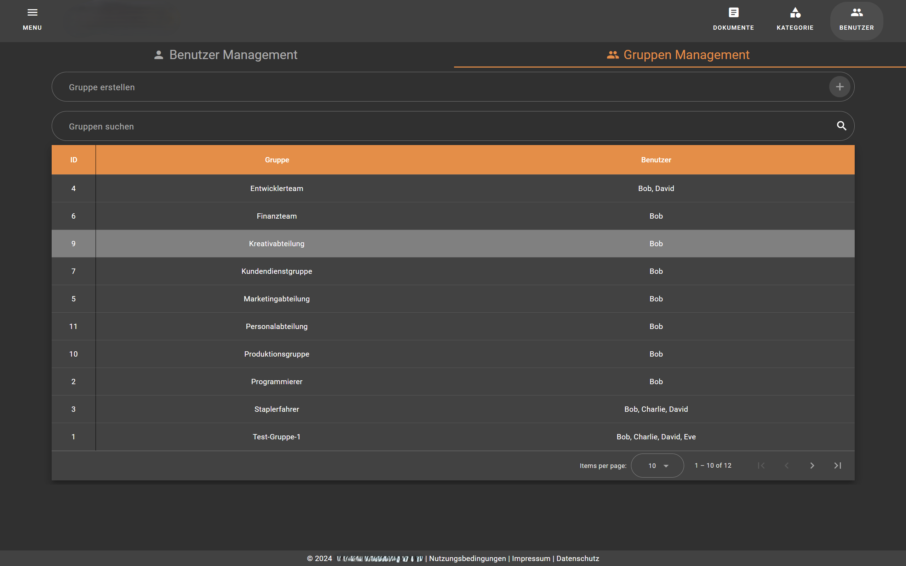
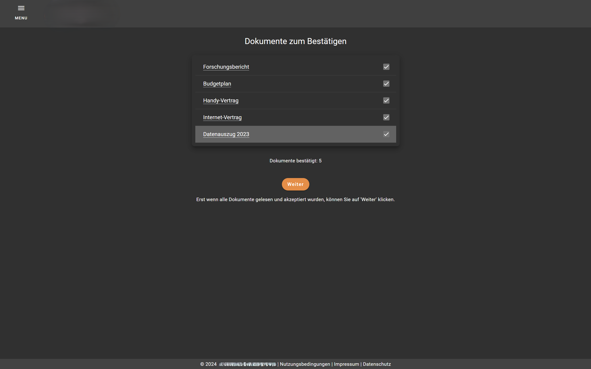
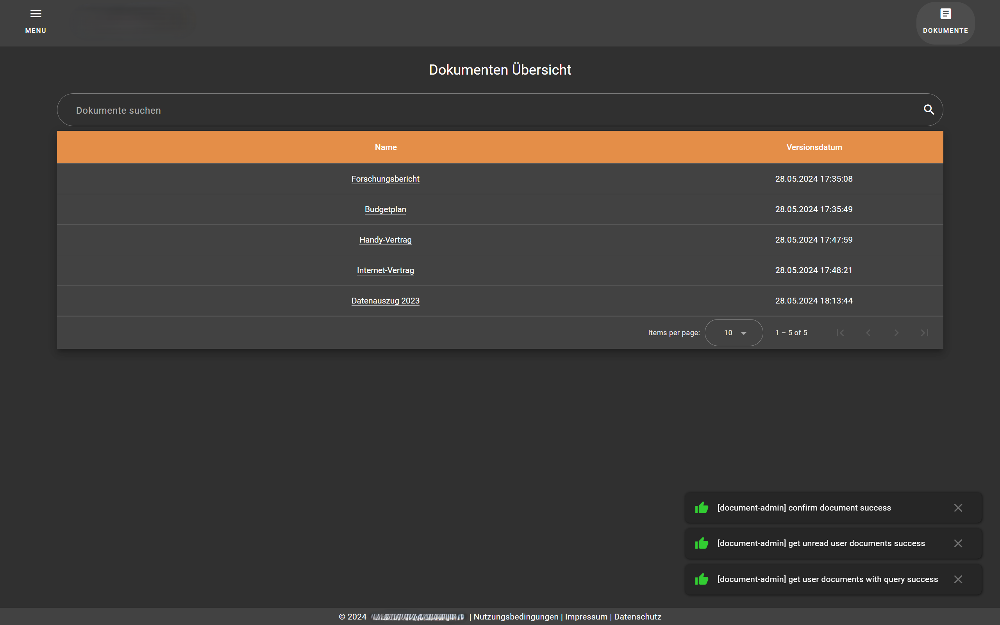

  

 

  <h1 align="center">Kultur Betriebe Burgenland</h1>
  <h3 align="center">Frontend für die Entwicklung der Web-Applikation Kultur Betriebe Burgenland</h3>

<!-- TABLE OF CONTENTS -->

  
Table of Contents

  <ol>
    <li>
      <a href="#about-the-project">About The Project</a>
      <ul>
        <li><a href="#built-with">Built With</a></li>
      </ul>
    </li>
    <li>
      <a href="#getting-started">Getting Started</a>
      <ul>
        <li><a href="#prerequisites">Prerequisites</a></li>
        <li><a href="#installation">Installation</a></li>
      </ul>
    </li>
    <li><a href="#usage">Usage</a></li>
    <li><a href="#contributing">Contributing</a></li>
    <li><a href="#license">License</a></li>
    <li><a href="#contact">Contact</a></li>
    <li><a href="#acknowledgments">Acknowledgments</a></li>
  </ol>

<!-- ABOUT THE PROJECT -->

## About The Project

The project serves as a document management system, offering various functionalities such as creating user groups, categories, and documents. When creating a new document, all users are notified via email about the new document. Upon logging into the application via a login window, users are initially redirected to a page where they must manually confirm the document before accessing the main view.

Additionally, the system includes user management, allowing administrators to grant or revoke administrator rights to users. Documents can be opened and viewed in the web interface. Administrators have the ability to create new versions of a document and hide documents from users' view. All tables in the system feature sorting, pagination, and search functionalities to facilitate navigation and management.

## Project Components

### Main Components

1. **Login**: Features a modern login window where users can log in using their username and password.

2. **Document-Management (Admin-View)**: This component comprises a feature-rich table listing all documents and their versions. It allows the creation of new documents or new versions of existing ones. Documents can be viewed in the web interface, and there is an option to mark documents as "hidden".

3. **Create-Document-Dialog (Admin-View)**: This component consists of three input fields with validations. The first field is for entering the document name. The second field allows users to upload a document via the file explorer, with validation for file type (PDF) and size. The third field is for adding categories to the document. The document can only be saved or created when all fields are filled out correctly and without errors. If a new version of an existing document is created, the document name is pre-filled and cannot be changed.

4. **Category-Mangagement (Admin-View)**: This component includes a feature-rich table listing all categories. It allows the creation of new categories or editing existing ones.

5. **Create-Category-Dialog (Admin-View)**: This component consists of two input fields with validations. The first field is for entering the category name. The second field is for adding user groups. The category can only be saved or created when all fields are filled out correctly and without errors. If an existing category is being edited, the category name is pre-filled and immutable. Additionally, user groups are pre-populated in the select dropdown and can be modified.

6. **User-Groups-Management (Admin-View)**: This component contains two tabs that switch between user management and group management views using lazy loading.

7. **User-Management (Admin-View)**: This component includes a feature-rich table listing all users. Administrator rights can be granted or revoked, and users can be added to or removed from different user groups.

8. **Group-Management (Admin-View)**: This component comprises a feature-rich table listing all user groups. New groups can be created.

9. **Confirm-New-Documents (User-View)**: This component contains a list of all new documents for the logged-in user. These documents can be viewed and manually confirmed. Additionally, there is a "Continue" button that leads to the main view and can only be pressed once all documents have been confirmed.

10. **Documents-Overview (User-View)**: This component comprises a feature-rich table listing all documents and their versions for the logged-in user. These documents can be opened in a web view for viewing.

### Additional Components

11. **Page-Not-Found**: This component includes a message informing the user that the specified link does not exist, along with a link to return to the login page.

12. **Page-Not-Permitted**: This component includes a message informing the user that they do not have the required permissions to access the page. Additionally, there is a link to return to the login page.

### Shared Components

13. **Fab-Button**: This component includes a reusable button with predefined attributes and specific styling.

14. **Backend-Error-Messages**: This component contains a reusable message with predefined attributes, which is displayed to the user, for example, during login.

15. **Display-Document-Dialog**: This component contains a window in which a PDF file can be displayed.

16. **Notification**: This component is used to display the status of a transmitted action to the user in the form of an alert box. The display duration of the notification varies depending on the success or failure of the action. Additionally, notifications can be manually closed.

### Integration with Backend-API

In a parallel project, a Spring Boot application was developed. This application manages database calls and handles authentication via Active Directory, as well as a mail distribution system.

- [Link to GitHub-Repo](https://github.com/DanuBizz/KulturBetriebeBurgenland-BE)

(<a href="#readme-top">back to top</a>)

### Built With

This project leverages a powerful technology stack to ensure robustness, scalability, and ease of development.

Angular ->
[][Angular-url]Angular-Material ->
[][Angular-Material-url]Bootstrap ->
[][Bootstrap-url] NGRX ->
[][NGRX-url]

(<a href="#readme-top">back to top</a>)

<!-- GETTING STARTED -->

## Getting Started

Follow these steps to set up and run the application in your local environment.

### Prerequisites

Make sure you have the following installed:

- [Java Development Kit (JDK 17)](https://www.oracle.com/java/technologies/javase-downloads.html)
- [Docker](https://www.docker.com/get-started)
- [Install Angular (v.17)](https://angular.io/guide/setup-local)

Depending on the browser of your choice, you will need the Redux extension for the browser. The example below is only for Google Chrome

- [Redux (Google Chrome)](https://chromewebstore.google.com/detail/redux-devtools/lmhkpmbekcpmknklioeibfkpmmfibljd?hl=de)

Then you should find redux in dev-tools. Looks like this:

    

If you work with Visual Studio you need the following plugins. JetBrain IDE installs them automatically! To do this, go to Visual Studio under Extension in the Marketplace and search for:

- Prettier Code-Formatter
- ESLint

### Installation

#### Navigate to the project root directory

- Make sure you have already completed the instructions for the other repository. [Link KulturBetriebeBurgenland-BE Repository](https://github.com/DanuBizz/KulturBetriebeBurgenland-BE?tab=readme-ov-file#kulturbetriebeburgenland)

#### Clone the repositories

- git clone https://github.com/DanuBizz/KulturBetriebeBurgenland-FE.git

#### Open the Web Application

- open the application in your prefered development enviroment or Editor (We used Intellij or Visual Studio Code)

#### Install Modules

- install the modules with the command "npm install" in the cli

#### Run Server

- run the application with the command "ng serve"

(<a href="#readme-top">back to top</a>)

<!-- USAGE EXAMPLES -->

## Screenshots

### LOGIN PAGE

    
    

(<a href="#readme-top">back to top</a>)

## ADMIN VIEW

### DOCUMENT-MANAGEMENT PAGE

#### Default view

    
    

 

#### Select document and expand row view

    
    

(<a href="#readme-top">back to top</a>)

### CREATE-DOCUMENT PAGE

#### Create a new docuement

    
    

 

#### Create a new version of an existing docuement

    
    

(<a href="#readme-top">back to top</a>)

### CATEGORY-MANAGEMENT PAGE

    
    

(<a href="#readme-top">back to top</a>)

### CREATE CATEGORY PAGE

#### Create a new category

    
    

 

#### Edit an existing category

    
    

(<a href="#readme-top">back to top</a>)

### USER MANAGEMENT PAGE

    
    

 

(<a href="#readme-top">back to top</a>)

### GROUP MANAGEMENT PAGE

    
    

 

(<a href="#readme-top">back to top</a>)

## USER VIEW

### CONFIRM NEW DOCUMENT PAGE

    
    

 

(<a href="#readme-top">back to top</a>)

### DOCUMENT OVERVIEW PAGE

    
    

 

(<a href="#readme-top">back to top</a>)

### OPEN FILE PAGE

    

 

(<a href="#readme-top">back to top</a>)

### PAGE NOT FOUND & PAGE NOT PERMITTED

    
        

 

(<a href="#readme-top">back to top</a>)

<!-- CONTRIBUTING -->

## Contributing

Contributions are what make the open source community such an amazing place to learn, inspire, and create. Any contributions you make are **greatly appreciated**.

If you have a suggestion that would make this better, please fork the repo and create a pull request. You can also simply open an issue with the tag "enhancement".
Don't forget to give the project a star! Thanks again!

1. Fork the Project
2. Create your Feature Branch (`git checkout -b feature/AmazingFeature`)
3. Commit your Changes (`git commit -m 'Add some AmazingFeature'`)
4. Push to the Branch (`git push origin feature/AmazingFeature`)
5. Open a Pull Request

(<a href="#readme-top">back to top</a>)

<!-- LICENSE -->

## License

Distributed under the Apache 2.0 License. See `LICENSE` for more information.

(<a href="#readme-top">back to top</a>)

<!-- CONTACT -->

## Contact

- MikeSirb - 2210859010@fh-burgenland.at
- DanuBizz - 2210859021@fh-burgenland.at
- Hasnat-Sajid - 2210859008@fh-burgenland.at

(<a href="#readme-top">back to top</a>)

<!-- MARKDOWN LINKS & IMAGES -->

[Angular-url]: https://angular.io/
[Angular-logo]: https://next.material.angular.io/assets/img/homepage/angular-logo.svg
[Bootstrap-url]: https://getbootstrap.com/
[Bootstrap-logo]: https://getbootstrap.com/docs/5.3/assets/brand/bootstrap-logo-shadow.png
[Angular-Material-url]: https://material.angular.io/
[Angular-Material-logo]: https://material.angular.io/assets/img/angular-material-logo.svg
[NGRX-url]: https://ngrx.io/
[NGRX-logo]: https://ngrx.io/assets/images/badge.svg
